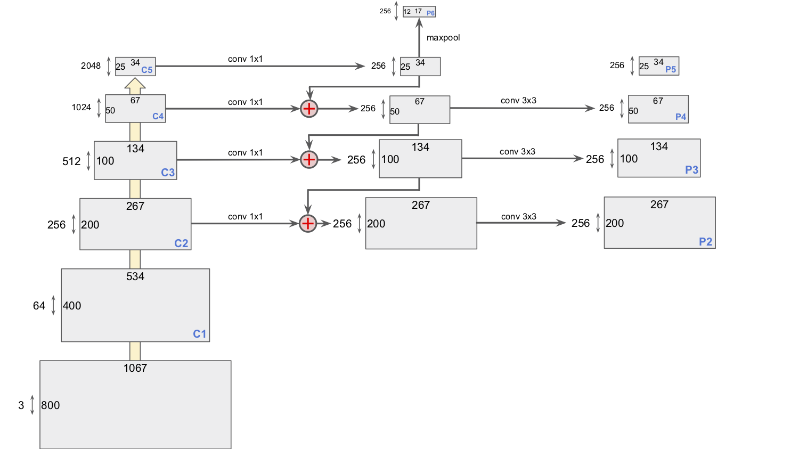

# easy-fpn.pytorch

An easy implementation of [FPN](https://arxiv.org/pdf/1612.03144.pdf) in PyTorch based on our [easy-faster-rcnn.pytorch](https://github.com/potterhsu/easy-faster-rcnn.pytorch) project.


## Demo


## Features

* Supports PyTorch 0.4.1
* Supports `PASCAL VOC 2007` and `MS COCO 2017` datasets
* Supports `ResNet-18`, `ResNet-50` and `ResNet-101` backbones (from official PyTorch model)
* Supports `ROI Pooling` and `ROI Align` pooling modes
* Matches the performance reported by the original paper
* It's efficient with maintainable, readable and clean code


## Benchmarking

* PASCAL VOC 2007

    * Train: 2007 trainval (5011 images)
    * Eval: 2007 test (4952 images)

    <table>
        <tr>
            <th>Implementation</th>
            <th>Backbone</th>
            <th>GPU</th>
            <th>Training Speed (FPS)</th>
            <th>Inference Speed (FPS)</th>
            <th>mAP</th>
            <th>image_min_side</th>
            <th>image_max_side</th>
            <th>anchor_ratios</th>
            <th>anchor_scales</th>
            <th>pooling_mode</th>
            <th>rpn_pre_nms_top_n (train)</th>
            <th>rpn_post_nms_top_n (train)</th>
            <th>rpn_pre_nms_top_n (eval)</th>
            <th>rpn_post_nms_top_n (eval)</th>
            <th>learning_rate</th>
            <th>momentum</th>
            <th>weight_decay</th>
            <th>step_lr_size</th>
            <th>step_lr_gamma</th>
            <th>num_steps_to_finish</th>
        </tr>
        <tr>
            <td>
                <a href="https://drive.google.com/open?id=1Y3hipZECPCkywbHz1EBBISalz9bkwroP">
                    Ours
                </a>
            </td>
            <td>ResNet-101</td>
            <td>GTX 1080 Ti</td>
            <td>~ 3.3</td>
            <td>~ 9.5</td>
            <td>0.7627|0.7604 (60k|70k)</td>
            <td>800</td>
            <td>1333</td>
            <td>[(1, 2), (1, 1), (2, 1)]</td>
            <td>[1]</td>
            <td>align</td>
            <td>12000</td>
            <td>2000</td>
            <td>6000</td>
            <td>1000</td>
            <td>0.001</td>
            <td>0.9</td>
            <td>0.0001</td>
            <td>50000</td>
            <td>0.1</td>
            <td>70000</td>
        </tr>
    </table>

    > Scroll to right for more configurations

* MS COCO 2017

    * Train: 2017 Train drops images without any objects (117266 images)
    * Eval: 2017 Val drops images without any objects (4952 images)

    <table>
        <tr>
            <th>Implementation</th>
            <th>Backbone</th>
            <th>GPU</th>
            <th>Training Speed (FPS)</th>
            <th>Inference Speed (FPS)</th>
            <th>AP@[.5:.95]</th>
            <th>image_min_side</th>
            <th>image_max_side</th>
            <th>anchor_ratios</th>
            <th>anchor_scales</th>
            <th>pooling_mode</th>
            <th>rpn_pre_nms_top_n (train)</th>
            <th>rpn_post_nms_top_n (train)</th>
            <th>rpn_pre_nms_top_n (eval)</th>
            <th>rpn_post_nms_top_n (eval)</th>
            <th>learning_rate</th>
            <th>momentum</th>
            <th>weight_decay</th>
            <th>step_lr_size</th>
            <th>step_lr_gamma</th>
            <th>num_steps_to_finish</th>
        </tr>
        <tr>
            <td>Original Paper</td>
            <td>ResNet-101</td>
            <td>-</td>
            <td>-</td>
            <td>-</td>
            <td>0.362</td>
            <td>-</td>
            <td>-</td>
            <td>-</td>
            <td>-</td>
            <td>-</td>
            <td>-</td>
            <td>-</td>
            <td>-</td>
            <td>-</td>
            <td>-</td>
            <td>-</td>
            <td>-</td>
            <td>-</td>
            <td>-</td>
            <td>-</td>
        </tr>
        <tr>
            <td>
                <a href="https://drive.google.com/open?id=1KWThl86AGraRROh2J5TqeXxAUyE-OIwa">
                    Ours
                </a>
            </td>
            <td>ResNet-101</td>
            <td>GTX 1080 Ti</td>
            <td>~ 3.3</td>
            <td>~ 9.5</td>
            <td>0.363</td>
            <td>800</td>
            <td>1333</td>
            <td>[(1, 2), (1, 1), (2, 1)]</td>
            <td>[1]</td>
            <td>align</td>
            <td>12000</td>
            <td>2000</td>
            <td>6000</td>
            <td>1000</td>
            <td>0.001</td>
            <td>0.9</td>
            <td>0.0001</td>
            <td><b>900000</b></td>
            <td>0.1</td>
            <td><b>1640000</b></td>
        </tr>
    </table>
    
    > Scroll to right for more configurations

* PASCAL VOC 2007 Cat Dog

    * Train: 2007 trainval drops categories other than cat and dog (750 images)
    * Eval: 2007 test drops categories other than cat and dog (728 images)

* MS COCO 2017 Person

    * Train: 2017 Train drops categories other than person (64115 images)
    * Eval: 2017 Val drops categories other than person (2693 images)

* MS COCO 2017 Car

    * Train: 2017 Train drops categories other than car (12251 images)
    * Eval: 2017 Val drops categories other than car (535 images)

* MS COCO 2017 Animal

    * Train: 2017 Train drops categories other than bird, cat, dog, horse, sheep, cow, elephant, bear, zebra and giraffe (23989 images)
    * Eval: 2017 Val drops categories other than bird, cat, dog, horse, sheep, cow, elephant, bear, zebra and giraffe (1016 images)


## Requirements

* Python 3.6
* torch 0.4.1
* torchvision 0.2.1
* tqdm

    ```
    $ pip install tqdm
    ```

* tensorboardX

    ```
    $ pip install tensorboardX
    ```


## Setup

1. Prepare data
    1. For `PASCAL VOC 2007`

        1. Download dataset

            - [Training / Validation](http://host.robots.ox.ac.uk/pascal/VOC/voc2007/VOCtrainval_06-Nov-2007.tar) (5011 images)
            - [Test](http://host.robots.ox.ac.uk/pascal/VOC/voc2007/VOCtest_06-Nov-2007.tar) (4952 images)

        1. Extract to data folder, now your folder structure should be like:

            ```
            easy-faster-rcnn.pytorch
                - data
                    - VOCdevkit
                        - VOC2007
                            - Annotations
                                - 000001.xml
                                - 000002.xml
                                ...
                            - ImageSets
                                - Main
                                    ...
                                    test.txt
                                    ...
                                    trainval.txt
                                    ...
                            - JPEGImages
                                - 000001.jpg
                                - 000002.jpg
                                ...
                    - ...
            ```

    1. For `MS COCO 2017`

        1. Download dataset

            - [2017 Train images [18GB]](http://images.cocodataset.org/zips/train2017.zip) (118287 images)
                > COCO 2017 Train = COCO 2015 Train + COCO 2015 Val - COCO 2015 Val Sample 5k
            - [2017 Val images [1GB]](http://images.cocodataset.org/zips/val2017.zip) (5000 images)
                > COCO 2017 Val = COCO 2015 Val Sample 5k (formerly known as `minival`)
            - [2017 Train/Val annotations [241MB]](http://images.cocodataset.org/annotations/annotations_trainval2017.zip)

        1. Extract to data folder, now your folder structure should be like:

            ```
            easy-faster-rcnn.pytorch
                - data
                    - COCO
                        - annotations
                            - instances_train2017.json
                            - instances_val2017.json
                            ...
                        - train2017
                            - 000000000009.jpg
                            - 000000000025.jpg
                            ...
                        - val2017
                            - 000000000139.jpg
                            - 000000000285.jpg
                            ...
                    - ...
            ```

1. Build CUDA modules

    1. Define your CUDA architecture code

        ```
        $ export CUDA_ARCH=sm_61
        ```

        * `sm_61` is for `GTX 1080 Ti`, to see others visit [here](http://arnon.dk/matching-sm-architectures-arch-and-gencode-for-various-nvidia-cards/)

        * To check your GPU architecture, you might need following script to find out GPU information

            ```
            $ nvidia-smi -L
            ```

    1. Build `Non-Maximum-Suppression` module

        ```
        $ nvcc -arch=$CUDA_ARCH -c --compiler-options -fPIC -o nms/src/nms_cuda.o nms/src/nms_cuda.cu
        $ python nms/build.py
        $ python -m nms.test.test_nms
        ```

        * Result after unit testing

            

    1. Build `ROI-Align` module (modified from [RoIAlign.pytorch](https://github.com/longcw/RoIAlign.pytorch))

        ```
        $ nvcc -arch=$CUDA_ARCH -c --compiler-options -fPIC -o roi/align/src/cuda/crop_and_resize_kernel.cu.o roi/align/src/cuda/crop_and_resize_kernel.cu
        $ python roi/align/build.py
        ```

1. Install `pycocotools` for `MS COCO 2017` dataset

    1. Clone and build COCO API

        ```
        $ git clone https://github.com/cocodataset/cocoapi
        $ cd cocoapi/PythonAPI
        $ make
        ```
        > It's not necessary to be under project directory

    1. If an error with message `pycocotools/_mask.c: No such file or directory` has occurred, please install `cython` and try again

        ```
        $ pip install cython
        ```

    1. Copy `pycocotools` into project

        ```
        $ cp -R pycocotools /path/to/project
        ```


## Usage

1. Train

    * To apply default configuration (see also `config/`)
        ```
        $ python train.py -s=coco2017 -b=resnet101
        ```

    * To apply custom configuration (see also `train.py`)
        ```
        $ python train.py -s=coco2017 -b=resnet101 --pooling_mode=align
        ```

1. Evaluate

    * To apply default configuration (see also `config/`)
        ```
        $ python eval.py -s=coco2017 -b=resnet101 /path/to/checkpoint.pth
        ```

    * To apply custom configuration (see also `eval.py`)
        ```
        $ python eval.py -s=coco2017 -b=resnet101 --pooling_mode=align /path/to/checkpoint.pth
        ```

1. Infer

    * To apply default configuration (see also `config/`)
        ```
        $ python infer.py -c=/path/to/checkpoint.pth -s=coco2017 -b=resnet101 /path/to/input/image.jpg /path/to/output/image.jpg
        ```

    * To apply custom configuration (see also `infer.py`)
        ```
        $ python infer.py -c=/path/to/checkpoint.pth -s=coco2017 -b=resnet101 -p=0.9 /path/to/input/image.jpg /path/to/output/image.jpg
        ```


## Notes

* Illustration for feature pyramid (see `forward` in `model.py`)

    ```python
    # Bottom-up pathway
    c1 = self.conv1(image)
    c2 = self.conv2(c1)
    c3 = self.conv3(c2)
    c4 = self.conv4(c3)
    c5 = self.conv5(c4)

    # Top-down pathway and lateral connections
    p5 = self.lateral_c5(c5)
    p4 = self.lateral_c4(c4) + F.interpolate(input=p5, size=(c4.shape[2], c4.shape[3]), mode='nearest')
    p3 = self.lateral_c3(c3) + F.interpolate(input=p4, size=(c3.shape[2], c3.shape[3]), mode='nearest')
    p2 = self.lateral_c2(c2) + F.interpolate(input=p3, size=(c2.shape[2], c2.shape[3]), mode='nearest')

    # Reduce the aliasing effect
    p4 = self.dealiasing_p4(p4)
    p3 = self.dealiasing_p3(p3)
    p2 = self.dealiasing_p2(p2)

    p6 = F.max_pool2d(input=p5, kernel_size=2)
    ```

    

* Illustration for "find labels for each `anchor_bboxes`" in `region_proposal_network.py`

    

    

* Illustration for NMS CUDA

    
